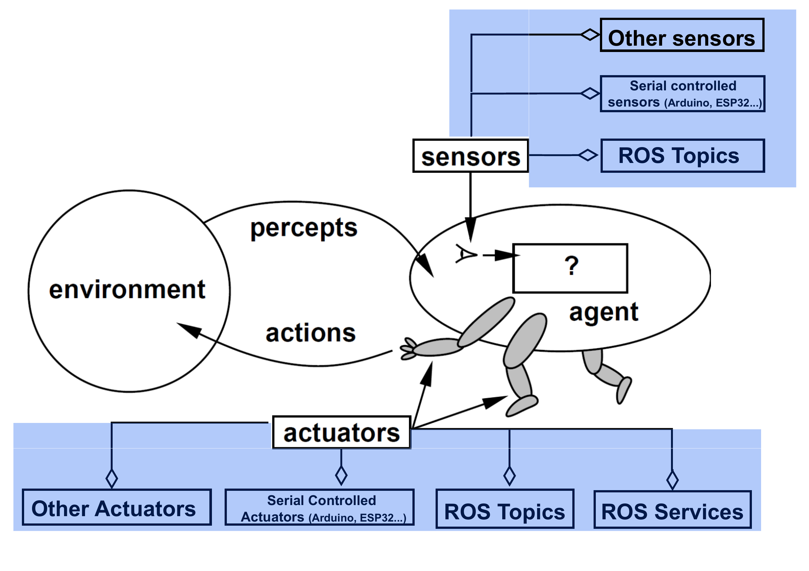

# 1. Our Vision on Cyber-Physical BDI Agents (CP-BDI)

## Overview

#### BDI agents composed of software + hardware unified in a single entity.

- Perception includes values read from sensors.
- The actions repertoire includes actions enabled by physical actuators.
- The hardware is not an external device to be used by the agent. The hardware  __is part__ of the agent.


#### Example: Autonomous Vehicle

The agent does not drive the car.

- It does not merely activate motors or read distance sensors.

The agent itself is the car.

- Moving forward is an agent action.
- Obstacle distance is part of the agent’s perception.


## Architecture Overview
Sources of the agents' perceptions include physical devices, which may also execute the agents' actions. These devices include:

- ROS Topics
- ROS Services
- Serial-controlled sensors (Arduino, ESP32, etc.)
- Other sensors and actuators

.Image adapted from Russell and Norvig (1995)


---

## Implementation Principles

### Passive Perception

- Perceptions are acquired when sensor values are available. The agent does not actively request sensor readings.

### Physical Actions as Internal Actions

* Physical actions are part of the agent implementation.
* There is a decoupling between action and actuation.
* One action may require multiple low-level actuations.
* Some aspects require special attention:
  ** reasoning cycle blocking
  ** synchronization
  ** execution timing

---

## Design Principle 1 — Decouple Behaviour and Functioning

#### Functioning: what the hardware can do. 
Exammple: a ground vehicle can:

- move forward
- turn left
- turn right

#### Behaviour: what the agent program does:

Example: an agent controlling a ground vehiche should turn left when perceives an obstacle.

### Key Idea

- Same behaviour → different hardware
- Different behaviour → same hardware
- Behaviour is decoupled from hardware complexity

---

## Design Principle 2 — Exploit JaCaMo as Much as Possible

* Agents run on PCs or single-board computers.
* Devices are connected through:

  ** serial communication
  ** ROS
  ** other means

---

# 2. Components

## Physical Portion

Sensors and actuators connected to devices controlled by software such as:

  - ROS
  - Arduino C/C++
  - Other hardware controlling software

---

## Agent Source Code

Agents are written as standard Jason agents without extending the language.

### Example

```asl
// initial goals
!move.
!log.

+!move : .random(X) & .random(Y)
 <- .move_turtle(X,Y);
    .wait(500);
    !move.

+!log
 <- .get_loggers;
    .wait(500);
    !log.

+turtle_position(x(X),y(Y))
 <- .print("New position: (", X, "; y: ", Y, ")").
```

### Device Configuration Example

```yaml
device_id: sample_roscore
className: embedded.mas.bridges.ros.RosMaster

microcontroller:
  id: ros1
  connectionString: ws://localhost:9090
  className: DefaultRos4EmbeddedMas

perceptionTopics:
  - topicName: turtle1/pose
    topicType: turtlesim/Pose
    beliefName: turtle_position

actions:
  serviceRequestActions:
    - actionName: move_turtle
      serviceName: /turtle1/teleport_relative
      params:
        - linear
        - angular

    - actionName: get_loggers
      serviceName: /turtlesim/get_loggers
```

---

## Agent Execution

### CyberPhysicalAgent + DefaultEmbeddedAgArch

Features:

- extension of default Jason architecture
- supports multiple physical or virtual devices
- perception process includes sensor reading
- actuation occurs through internal actions

### MAS Example

```yaml
mas:
  agents:
    sample_agent:
      ag-class: embedded.mas.bridges.jacamo.CyberPhysicalAgent
      ag-arch: embedded.mas.bridges.jacamo.DefaultEmbeddedAgArch
```

---

## Physical Device Interface

Responsibilities:

- transform sensor values into perceptions
- transform internal actions into actuations
- customize perception and action handling

---

## Perception Management

### Example 1 — Serial Device

```yaml
device_id: demo_serial_device
className: JSONQueueWatcherDevice

serialActions:
  - actionName: lightOn
    actuationName: light_on
```

Characteristics:

- transforms JSON data into perceptions
- buffers serial inputs
- uses the latest received package

---

### Example 2 — ROS Device

```yaml
device_id: demo_ros_device
className: embedded.mas.bridges.ros.RosMaster

perceptionTopics:
  - topicName: turtle1/pose
    topicType: turtlesim/Pose
    beliefName: turtle_position

actions:
  serviceRequestActions:
    - actionName: move_turtle
      serviceName: /turtle1/teleport_relative
      params:
        - linear
        - angular
```

Characteristics:

- transforms ROS literals into perceptions
- collects values from ROS topics

---

## Action Management

### Serial Device Example

Jason action:

```asl
.lightOn(10);
```

Serial output:

```text
light_on(10)
```

---

### ROS Example

Jason action:

```asl
move_turtle(0.9996, 0.4297)
```

ROS service representation:

```text
[serviceName=/turtle1/teleport_relative,
 serviceParameters=linear/0.9996,
 angular/0.4297]
```

---

# 3. General Purpose Physical Interface

Provides:

- read functions
- write functions
- interaction with physical components

---

# 4. High-Level Physical Interface

Responsibilities:

- handling communication protocols
- encapsulating transport details

## Read Operations

- extract payload from physical communication

## Write Operations

- add protocol metadata
- serialize outgoing data

---

## High-Level Interface Examples

### Serial Device

```yaml
device_id: demo_serial_device

microcontroller:
  id: arduino1
  className: Arduino4EmbeddedMas
  serial: "/dev/ttyUSB0"
  baudRate: 9600
```

---

### ROS Device

```yaml
device_id: demo_ros_device

microcontroller:
  id: ros1
  connectionString: ws://localhost:9090
  className: DefaultRos4EmbeddedMas
```

---

## Read Function Examples

### Serial Protocol

Input:

```text
==42::"dist_left":[0.500],"dist_right":[0.300]--
```

Output:

```json
{
  "dist_left": [0.500],
  "dist_right": [0.300]
}
```

---

### ROS Example

Input:

```json
[
  {
    "op":"publish",
    "topic":"turtle1/pose",
    "msg":{"x":5.75,"y":6.46,"theta":1.74}
  }
]
```

Output:

```prolog
[
  pose(x(5.75), y(6.46), theta(1.74)),
  energy(1.5)
]
```

---

## Write Function Examples

### Serial

Input:

```text
light_on(3600)
```

Output:

```text
light_on(3600)
```

---

### ROS

Input:

```text
[serviceName=/turtle1/teleport_relative,
 serviceParameters=linear/0.9996,
 angular/0.4297]
```

Output:

```json
{
  "op": "call_service",
  "service": "/turtle1/teleport_relative",
  "args": {
    "linear": 0.9996,
    "angular": 0.4297
  }
}
```

---

# 5. Resources

## Project Repository

https://github.com/embedded-mas/cyber-physical-bdi-agents

---

# 6. Applications

## Robotic Arm

Features:

- continuously monitors a buffer
- detects deposited objects
- reacts to requests from other agents
- simulated perceptions and actuations

Reference:

> KANO, P. K. B.; DE BRITO, MAIQUEL.  
> Desenvolvimento de um protótipo de braço robótico integrado a um agente BDI.  
> WESAAC 2023.

---

## Autonomous Ground Vehicles

Features:

- obstacle avoidance
- straight-line movement
- same agent program on multiple vehicles
- experiments with multiple microcontrollers

### Example Behaviour

```asl
+clear_path
 <- .print("No obstacles ahead. Starting motors");
    .front.

+obstacle_left
 <- .print("Turning right...");
    .left.

+obstacle_right
 <- .print("Turning left...");
    .right.

+obstacle_front
 <- .print("Obstacle too close! Moving backward...");
    .back.
```

---

## Line-Following Vehicles

Features:

- line following
- path computation between nodes
- reusable agent programs

### Example

```asl
!go_to(a,c).

+!go_to(Origin,Destination) :
    path(Origin,Destination,Path)
 <- !follow_path(Path).
```

---

## Cooperative ROS Robots

Features:

- cooperative simulated robots
- predefined route execution
- behaviour depends on:
  - assigned routes
  - number of robots

References:

- DIAS, P. H.; DE BRITO, MAIQUEL. Coordenação de robôs ROS com Agentes BDI e MOISE. WESAAC 2023.

---

## Cooperative UAVs

Features:

- UAV swarm coordination
- ROS + Gazebo + MRS-UAV
- cooperation with University of Manchester

References:

- Distributed UAV-Swarm Control Using BDI Agents
- UAV Swarm Control and Coordination Using Jason BDI Agents on Top of ROS

---

# 7. Open Challenges and Opportunities

## Research

- connection with new interfaces
- serial communication improvements
- performance evaluation
- new perception strategies

---

## Education and Training

### ROS-related Opportunities

- CARLA simulator
- Agile Robotics Competition
- robotics-oriented agent courses

Links:

- https://carla.org/
- https://www.nist.gov/el/intelligent-systems-division-73500/agile-robotics-industrial-automation-competition

---

# References

- Stuart Russell and Peter Norvig. *Artificial Intelligence: A Modern Approach*. Prentice Hall, 1995.

